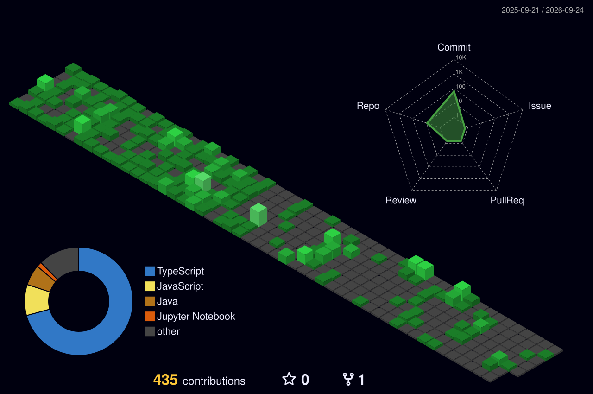

# 💫 About Me:
💫 Hi 👋, I'm Harsh Parab  A passionate Full Stack Developer || MERN Stack Developer || Java Developer from India 🇮🇳  📧 Email Me: harshparab865@gmail.com for collaborations, freelance projects, internships, or tech discussions. 😊  🔭 Currently working as a Full Stack Developer Intern at Musing Quills, developing responsive and user-centric web applications using modern technologies. 🌱 I'm currently learning: Advanced System Design, Cloud Computing, and DevOps 👯 I'm looking to collaborate on: MERN Stack, AI/ML, and Open-Source Projects 🤔 I'm looking for help with: Scaling full-stack applications and cloud deployment 💬 Ask me about: MERN Stack, Java, React.js, Node.js, MongoDB, and AI Projects 📫 How to reach me: harshparab865@gmail.com 🌐 Portfolio: Add your portfolio link here 😄 Pronouns: He/Him ⚡ Fun Fact: I enjoy turning innovative ideas into real-world applications and have built projects ranging from AI-powered platforms to AR-based solutions. 🚀 Experience  💼 Full Stack Developer Intern @ Musing Quills (Jan 2026 – Present)  💼 Full Stack Development Trainee @ EdTech India Institute of Bombay  💼 Software Developer & Android Development Intern @ SOFTTRON

## 🌐 Socials:
   

## 🧊 3D Contribution Calendar

<!-- Night Green -->

# 💻 Tech Stack:
                                    
# 📊 GitHub Stats:
 
 

### ✍️ Random Dev Quote

<!-- Proudly created with GPRM ( https://gprm.itsvg.in ) -->
